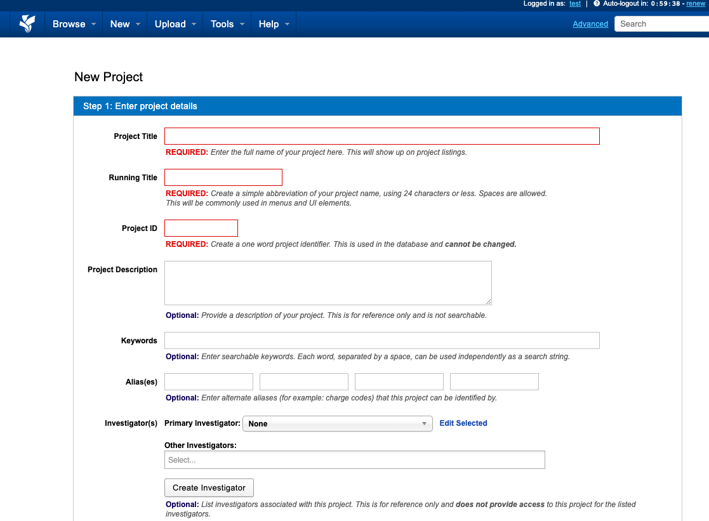

  

    Table of contents
  

  {: .text-delta }
1. TOC
{:toc}

 	

# 1.0. Login and project creation

### 1.1. Login to XNAT 

XNAT has a web interface that can be accessed by going to the [web-address](https://central.xnat.org/app/template/Login.vm#!) from any computer with an internet connection. Once the website is loaded, log in using your user credentials [(Fig.1).](#Manual/Login/Login)

|  | 
|:--:| 
| **Fig.1** *Login.* |

After you logged in, you can go to the project of interest by clicking on (i) *Browse > My projects* or (ii) the panel Projects in the XNAT home page [(Fig.2)](#Manual/Login/Homescreen). In addition, there is a panel describing your most *Recent activity* where you can go directly to one of the latest added (iii) subjects or directly to an specific (iv) subject’s session.

|  | 
|:--:| 
| **Fig.2** *Homescreen.* |

 	

### 1.2. Create Project 

To create a new project navigate to the header and click *New > Project* and give it a title, running title, project ID [(Fig.3)](#Manual/Login/Create). Here you can also provide further information, such as keyword. Lastly, define if the project is private, protected, or public and click *Create*.

|  | 
|:--:| 
| **Fig.3** *Create new project.* |

