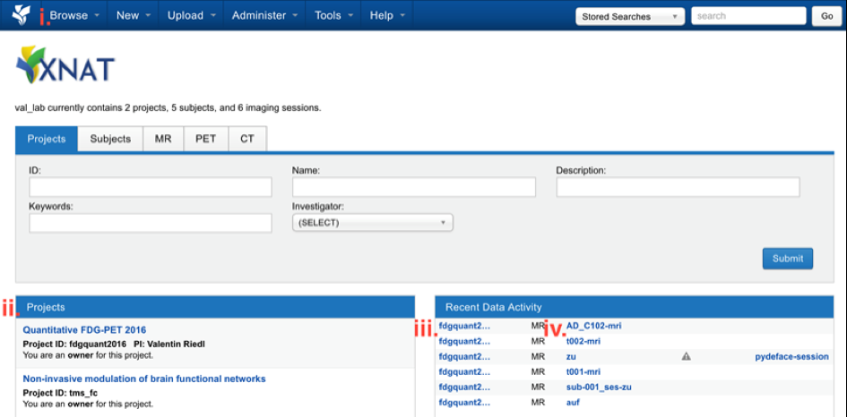
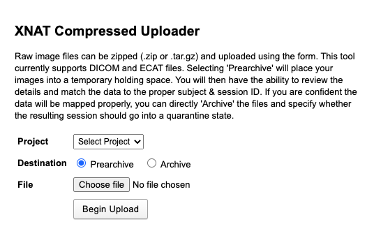
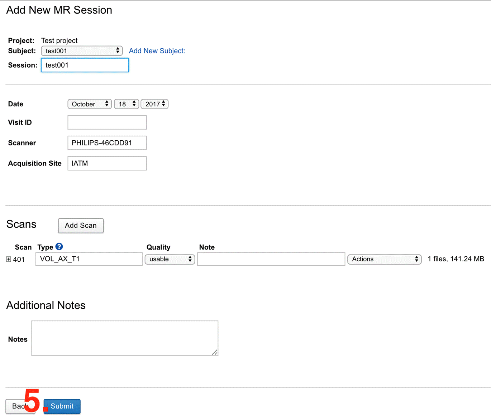

# 1.0. Login and project creation

### 1.0. Login to XNAT 

XNAT has a web interface that can be accessed by going to the [web-address](https://central.xnat.org/app/template/Login.vm#!) from any computer with an internet connection. Once the website is loaded, log in using your user credentials. 

|  | 
|:--:| 
| **Fig.1** *Login.* |

After you logged in, you can go to the project of interest by clicking on (i) *Browse > My projects* or (ii) the panel Projects in the XNAT home page. In addition, there is a panel describing your most *Recent activity* where you can go directly to one of the latest added (iii) subjects or directly to an specific (iv) subject’s session.

|  | 
|:--:| 
| **Fig.2** *Homescreen.* |

 	

### 1.1. Create Project and Upload data

Now you can upload a DICOM.zip to the *prearchive* [(Fig.4)](#Manual/Login/Prearchive) as explained in the following steps.

To create a new project navigate to the header and click *New > Project* and give it a title, running title, project ID. Here you can also provide further information, such as keyword. Lastly, define if the project is private, protected, or public and click *Create*.

Clicking the XNAT icon once more shows the newly created project in the project section.
In order to upload subject data click *Upload > Images > Compressed Uploader*. Proceed by selecting your project and choosing a destination.

|  | 
|:--:| 
| **Fig.3** *Compressed uploader.* |

By clicking *Prearchive* the data will temporarily be stored in a medium where you can control and change subject information before forwarding them to the archive. Now you can choose the data to be uploaded. Attention: Data has to be stored in a zip. file. Click *Begin Upload* to upload the imaging data to the prearchive.

Now you can proceed to the prearchive by navigating to *Upload > Prearchive*. The data of the newly added subject can now be reviewed and archived. 

1.	Select the study by clicking in the checkbox
2.	Click on *change projects*
3.	Select the project to which this project belongs to and click on *Ok*
4.	Reload the website, check the study like in 1.) and  click on *Review and Archive*
5.	Edit the information and proceed with *Submit* [(Fig.5)](#Manual/Login/information). You successfully uploaded one subject scan to the archive
6.	To check the uploaded study click on *Browse > My project > Test project* and select the subject ID and session [(Fig.6)](#Manual/Login/Archive)

|  | 
|:--:| 
| **Fig.4** *Prearchive.* |

|  | 
|:--:| 
| **Fig.5** *Subject information form.* |

When being in the archive you can click on *Manage Files* to view the DICOMS of the scan [(Fig.6)](#Manual/Login/Archive). By clicking *View Images*, XNAT provides you with a preliminary graphical representation of your imaging data (DICOMS).

|  | 
|:--:| 
| **Fig.6** *Session page archive.* |

 	

### 1.2. Troubleshooting

If you are sure that you sent the data to XNAT but you cannot find them either in the prearchive [(Fig.4)](#Manual/Login/Prearchive) nor in the archive [(Fig.6)](#Manual/Login/Archive) of the XNAT Intranet, try the following: 

- You might have forgotten to assign a proper project name to the subject. In this case, the data cannot be assigned. Ask your administrator to have a look in his prearchive to see if there are un-assigned data floating around

