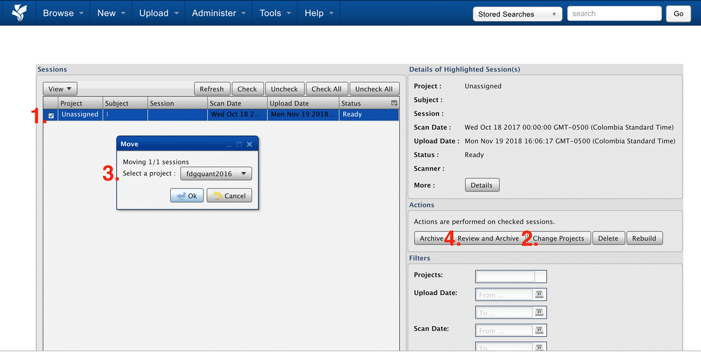
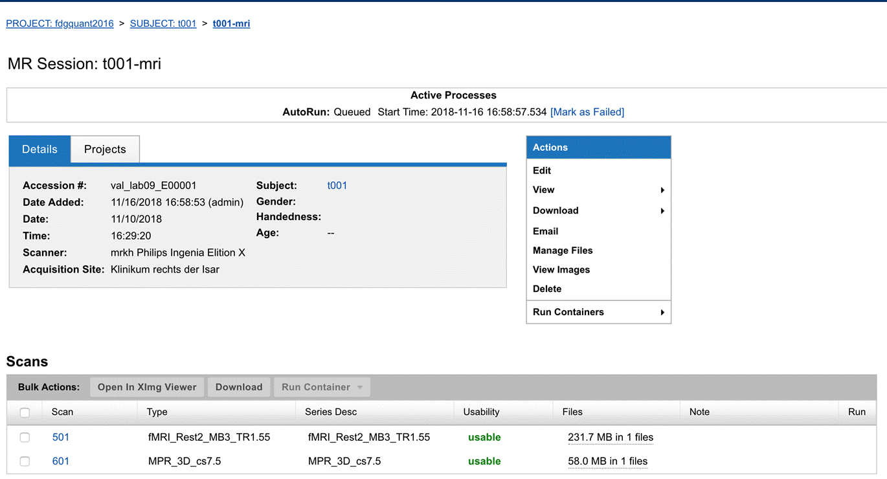
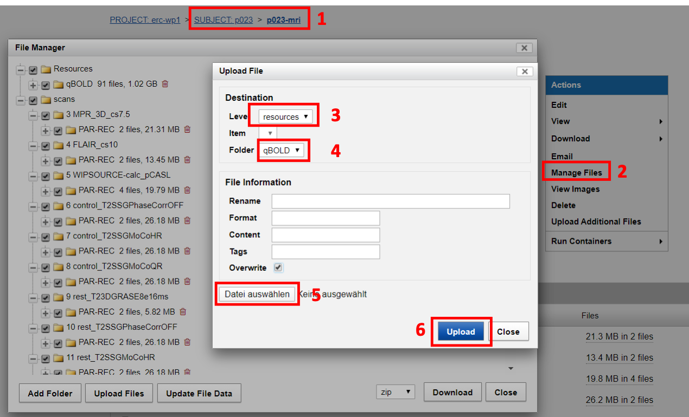
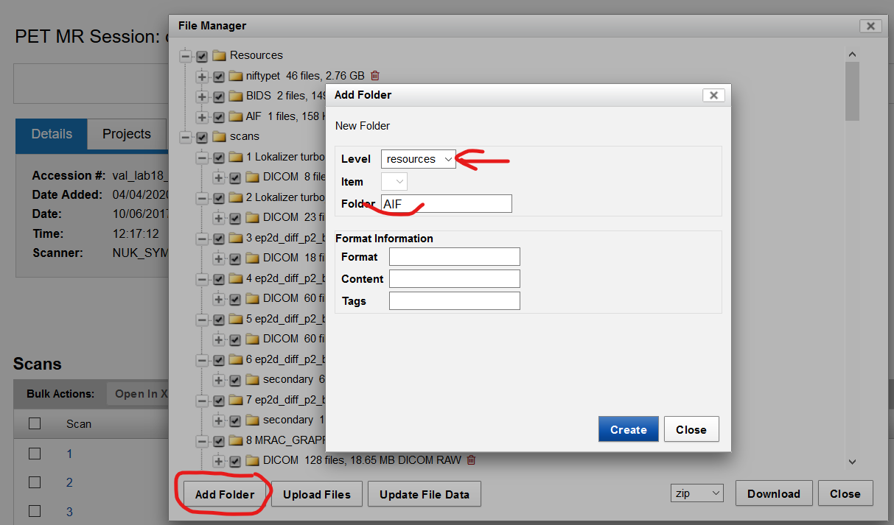
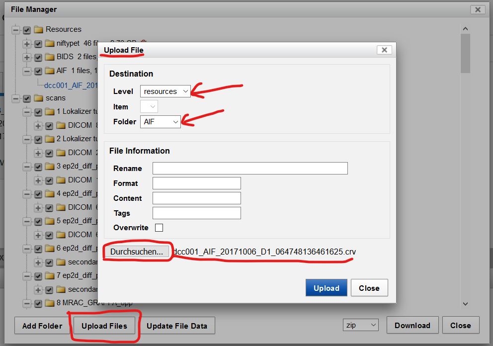

<details markdown="block">
  <summary>
    Table of contents
  </summary>
  {: .text-delta }
1. TOC
{:toc}
</details>

<br/>	


# 2.0. Upload of Data

### 2.1. Manual upload

Now you can upload [(Fig.1)](#Manual/Login/Compressed_Uploader) a DICOM.zip to the *prearchive* [(Fig.2)](#Manual/Login/Prearchive) as explained in the following steps. If you do not have a data set at hand you can download our [test data](../../Test_Data/index.md) set.

Clicking the XNAT icon once more shows the newly created project in the project section.
In order to upload subject data click *Upload > Images > Compressed Uploader*. Proceed by selecting your project and choosing a destination.

<a name="Manual/Login/Compressed_Uploader"></a>

|  | 
|:--:| 
| **Fig.1** *Compressed uploader.* |


By clicking *Prearchive* the data will temporarily be stored in a medium where you can control and change subject information before forwarding them to the archive. You can bypass that configuration by directly archiving your session files. Now you can choose the data to be uploaded. 

**Attention**: Data has to be stored in a zip. file or .tar.gz archive file. **Note**: If you upload a large file from a network drive, you may notice some lag in performance. 

Click *Begin Upload* to upload the imaging data to the prearchive. This takes some time, you can oversee the upload in the progress panel. Even if there's a time-out error, the upload still continues. Assuming your archive is properly formatted, the files will be extracted and reviewed and sent to the destination that you selected. Now you can proceed to the prearchive by navigating to *Upload > Prearchive*. The data of the newly added subject can now be reviewed and archived. 

1.	Select the study by clicking in the checkbox
2.	Click on *change projects*
3.	Select the project to which this project belongs to and click on *Ok*
4.	Reload the website, check the study like in 1.) and  click on *Review and Archive*
5.	Edit the information and proceed with *Submit* [(Fig.3)](#Manual/Login/information). You successfully uploaded one subject scan to the archive
6.	To check the uploaded study click on *Browse > My project > Test project* and select the subject ID and session [(Fig.4)](#Manual/Login/Archive)

<a name="Manual/Login/Prearchive"></a>

|  | 
|:--:| 
| **Fig.2** *Prearchive.* |


<a name="Manual/Login/information"></a>

|  | 
|:--:| 
| **Fig.3** *Subject information form.* |


When being in the archive you can click on *Manage Files* to view the DICOMS of the scan [(Fig.7)](#Manual/Login/Archive). By clicking *View Images*, XNAT provides you with a preliminary graphical representation of your imaging data (DICOMS).

<a name="Manual/Login/Archive"></a>

|  | 
|:--:| 
| **Fig.4** *Archive session page.* |


<br/>	

### 2.2. Automated upload via script (DICOM images)	

If you want to upload several subjects at once, e.g. if you want to put an already conducted study / project on XNAT, you may consider using an upload script to prevent uploading each subject manually. As a first step, make sure that you created a new project on XNAT (this can only be done by the administrator), see [figure 3](#Manual/Login/Create). Make sure to go to *Manage > Enable anonymization script*.

Furthermore, make sure to have downloaded [DCMTK](https://support.dcmtk.org/docs/index.html "DICOM ToolKit package"). 

Here you can download an example script :

[Download](https://tumde.sharepoint.com/:u:/s/ValNeuroLab/EQMuOjKvFuNOh0BXBDmo7RkBzR_0To3RhxfLiUpOYj9D7g?e=rqTsQM){: .btn} 

1. Copy the script sendDCM2xnat.sh to your Linux computer. (Don't forget to run chmod +x sendDCM2xnat.sh to adjust executing permissions) 
2. Usage of script: see Code below
3. The folder structure should be the following: subjID > MR series name > DICOM images (important: no other subfolders / sublayers in-between allowed!)
4. If you have several subjects to upload, adjust this script and create a loop with all subject IDs
5. Important: make sure that the project is named correctly, otherwise the subjects cannot be assigned correctly


`endDCM2xnat manually v0.1 (alpha)`

Usage: `./sendDCM2xnat <subjectID> <session> <project> <serverIP> <serverPORT> <Subject DICOM directory>`

e.g: `bash ./sendDCM2xnat.sh fp666 petmr p_fpet_vis 10.32.48.142 8104 /Users/gabocas/Downloads/testSubj`

`<Subject DICOM directory>` Subject folder path with series as subfolders and DICOM files within each series folder


<br/>

### 2.3. Automated upload: PAR-REC Python script

**This only works in a Linux/Mac environment!**
Additionally, via the script, series can be re-named and data structure / naming can be manipulated.

The following code bits need to be run via the terminal:


1. Be sure to have anaconda installed. `anaconda install`
2. Install pyxnat: `pip install pyxnat`
3. Install jupyter: `conda install jupyter`
4. Copy the script .xnatPass (please note: without any extension and with the dot!) to your home folder and apply chmod +x (to get execute permissions)
	4. Linux terminal: `echo '{"server": "<xnat_ip>", "user": "<user>", "password": "<password>"}' > xnat_config.cfg`
	4. Initiate connection: `interface = pyxnat.Interface(config='.xnatPass.cfg')`
5. Change USER and PASSWORD in xnatPASS to your XNAT credentials
6. Copy and open the following script via jupyter notebooks or Visual Studio Code with Python extension installed:
	6. [Download](https://tumde.sharepoint.com/:u:/s/ValNeuroLab/EfQgPwNHQOFKqCuQkjqwtwgBxjBLVJmC_4hX8zH7dX1q4w?e=6d2Dac){: .btn} 
7. Be sure that subject-id and session match your project description in XNAT
8. Within the script, you can define which subjects, series etc. you want to upload
9. All series which are correctly named (defined in your naming script) will be automatically converted to BIDS data format


The following are code snippets from python, which you can execute e.g. within python notebooks or visual studio code with python extension. Here, a compressed folder called qBOLD is uploaded to xnat:resources for every subject.
	
```python
import pyxnat, os
from glob import glob
	
#adjust name of project and session
project_erc_id= "erc-wp1"
project_erc = pyxnat.Interface().select.project(project_erc_id)
session_erc = "mri"
	
# loop through sessions
sids = [ 20, 21, 22, 23 ]
for sid in sids:
    subj_erc_id="p%0.3d" % sid
    sess_erc_id = subj_erc_id + '-' + session_erc  
    sess_erc = project_erc.subject(subj_erc_id).experiment(sess_erc_id)
    base_folder = '/home/Path_placeholder'
    folder_with_qbold_results = base_folder + 'erc-wp1-' + subj_erc_id
    ! cd {folder_with_qbold_results};tar -czf qBOLD.tar.gz *
    sess_erc.resource('qBOLD').put_zip(os.path.join(folder_with_qbold_results,'qBOLD.tar.gz'))
```

This last snippet creates one zipped (.tar.gz) folder, in this case named 'qBOLD.tar.gz'.  
It then uploads all folders and subfolders that are inside qBOLD.tar.gz to the subject's resources folder.

<br/>


### 2.4. Troubleshooting

If you are sure that you sent the data to XNAT but you cannot find them either in the prearchive [(Fig.2)](#Manual/Login/Prearchive) nor in the archive [(Fig.4)](#Manual/Login/Archive) of the XNAT Intranet, try the following: 

- You might have forgotten to assign a proper project name to the subject. In this case, the data cannot be assigned. Ask your administrator to have a look in his prearchive to see if there are un-assigned data floating around


<br/>


### 2.5. Add data to existing project


Depending on where the data are, that you want to upload, different ways of uploading apply: 

1. The data are on the local clinic server system and you are also in the local environment (i.e. in the office)
	1. If this is the case, see section [2.2.](#22-automated-upload-via-script-dicom-images) & [2.3.](#23-automated-upload-par-rec-python-script)
2. The data are on your local machine: It will take a lot of time to upload data to the wks via the GUI! There are two options: 
	2. [Manual Upload](#a-manual-upload): Login via VPN to the local server system and upload from there (if you have big data, this is the only option) (See section [2.2.](#22-automated-upload-via-script-dicom-images) & [2.3.](#23-automated-upload-par-rec-python-script))
	2. [Upload via Python notebook (scp)](#b-upload-via-python-notebook-scp): If you only have small files: Upload to resources (or scans) following the two options displayed below 


#### A. Manual Upload

You can manually upload images to the resource folder of every single subject. This might be very time-consuming if you have several subjects in a project. For upload via script see section [2.2.](#22-automated-upload-via-script-dicom-images) & [2.3.](#23-automated-upload-par-rec-python-script)
Before you begin - per subject - zip all files you want to upload in one folder (if you want to upload several files) in one tar.gz file (tar -czf FILENAME.tar.gz FOLDERNAME).

[Legend figure 5:](#Manual/Login/Resources)
1. Go to the subject's session that you want to upload the files to
2. Click on *manage files*
3. Then choose *resources*
4. Choose the resources folder you want to upload to, e.g. qBOLD
5. Choose the zipped folder you want to upload 
6. Click *Upload*

Click *OK* if XNAT asks you to unzip the files


<a name="Manual/Login/Resources"></a>

|  | 
|:--:| 
| **Fig.5** *Resource upload.* |


**Adding AIF function to the existing participant's file**:

- In each subjects data directory, create a folder under the resources tab 


<a name="Manual/Login/AIF"></a>

|  | 
|:--:| 
| **Fig.6** *AIF function.* |


- Upload anonymized AIF file 

<a name="Manual/Login/AIF_2"></a>

|  | 
|:--:| 
| **Fig.7** *Anonymized AIF file.* |


#### B. Upload via Python notebook (scp)

If you have several files per subject you want to upload, this can be done via jupyter notebook. Follow these instructions to create a python notebook on the server: ** Section to be created**

```python
def cp_resource(xnat_resource, local_dir, direction, remote_path):
	'''
	Upload image to a specific folder on xnat or download the image from xnat.
	    
	xnat_resource : <Resource Object>
		scan object, with specific resource (eg. NIFTI) on xnat
	        
	local_dir : str
	    directory where to put the file
	        
	direction : str
	    'local2remote' -> get data for this scan
	    'remote2local' -> upload data to this scan
	        
	remote_path : str
	    name of the scan
	        
	Returns : <something> or None
	'''
	if (remote_path.find('*') >= 0):
	    remote_path = xnat_resource.files(remote_path)[0]._urn
	local_file = os.path.join(local_dir,remote_path)
	        
	if direction == 'remote2local':
	    local_path = os.path.dirname(local_file)
	    if not os.path.isdir(local_path): 
	        !mkdir -p {local_path}
	    xnat_resource.file(remote_path).get(local_file)
	    return local_file
	            
	elif direction == 'local2remote':
        xnat_resource.file(remote_path).insert(local_file,overwrite=True)
```

Use as follows: 

```python	
#Define resource directory on xnat: 
working_res = sess.resource('qBOLD') 

#copy files from RAID1/tmp/ to xnat wks in resource folder
cp_resource(working_res, local_dir, 'local2remote', 'rest/rabsgradz.nii')
cp_resource(working_res, local_dir, 'local2remote', 'rest/rTE1.nii')
```


